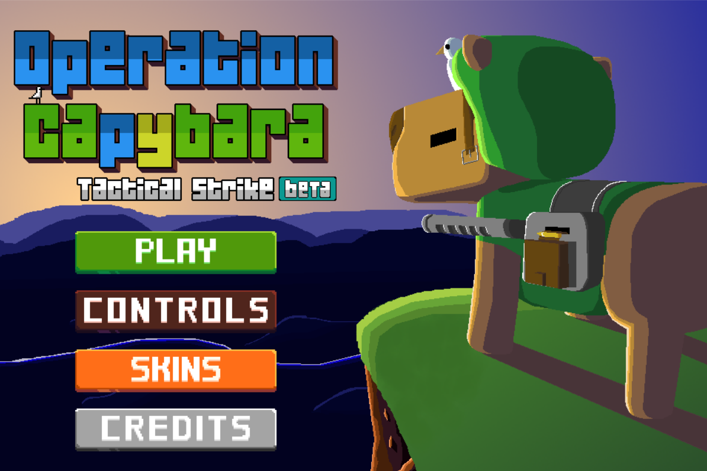

# Expotec-2024

Projeto para a Expotec 2024, 1º jogo

<p align="center">
    
</p>

## Requerimentos

O jogo foi feito utilizando a biblioteca `pygame`. Além dela, também foram necessários a utilização de outras bibliotecas que não são padrões do python, por isso é preciso que elas também sejam baixadas.

O comando para baixar todas as dependências é:
```sh
pip install -r requirements.txt
```

## Colaboradores

- [Arthur Guilherme](https://www.github.com/ArthurGui004)
- [Pedro Lucas](https://www.github.com/dargoes)
- [Guilherme Medeiros](https://www.github.com/GuiMeCa162)